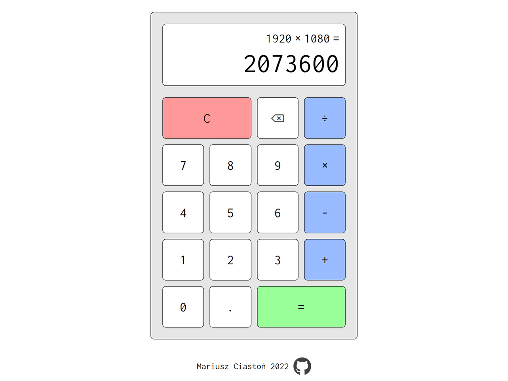

# Calculator

Calculator app created with HTML, CSS and JS. 

Features: 
• Responsive design based on grid 
• Buttons animation 
• Changing font size depending on number of digits (max 16 digits) 
• Keyboard input support 
• Floating point numbers calculation 

[Live Demo](https://mariuszciaston.github.io/Calculator/) :point_left:   

| 
------------- | 
